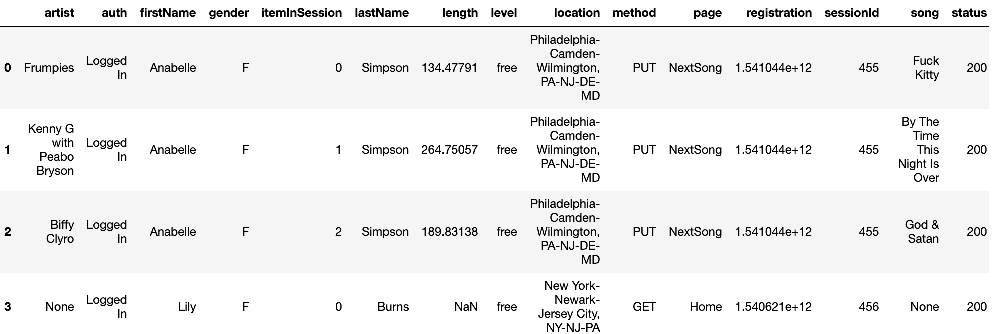

# Capstone introduction

As we learned in the last chapter, reliable robust data pipelines are very valuable
in the day to day job of an Data Engineer.
Since I also wanted to use the chance to deepen my knowledge regarding AWS,
I searched for ways how to build data pipelines with AWS. Of course, one could deploy an
EC2 Airflow instance. But doing my research I also found AWS StepFunctions which have a similar
concept as Airflow (building a graph with different execution steps).
Another important fact for me was to maintain reproducibility. I liked the Redshift deployment in the
course material, where we used `boto3`. The resources were defined in code and one could execute a Jupyter Notebook
instead of clicking everything together on AWS UI. Digging deeper, I found the AWS CDK framework, which made the concept
of IaC (Infrastructure as Code) even more accessible than `boto3`, by using normal python object programming.

With these two major components (Stepfunctions & IaC with CDK) my capstone project does not focus on the data itself
that much. But rather a defined workflow - still I am convinced, that this is very valuable for every Data Engineer.

My setup makes it quite easy to execute the PySpark job I created for Project submission 3. That is why I also
included it in this project for reference. 

On a side note: By setting up the right roles and access permission it is no 
longer necessary to pass credentials into our PySpark program from a config file. CDK will take care of that (by 
executing `cdk deploy ...` cdk has access to our local AWS credentials and uses them to create necessary roles).

# Data

Since this project is heavily focused around reliable development and deployment of data pipelines, I did not
specialise on new data.
Instead I used the well known sparkify data basis that we used throughout all projects. Hence, also my
data model of choice is very similar with Fact table `songstable` and dimensions `artists`,
`songs`, `time` and `users`.
The datasets are available at `s3://udacity-dend/song_data` and `s3://udacity-dend/log_data`.


The data is based on user activity data related to a music streaming app. 
By making this data available in a DWH/DataLake we should be able to identify what songs users are listening to.
Since the data is only available in JSON format, we need to establish ETL processes that transform the 
data into a proper data model. 


## Song Data
This dataset stems from the Million Song Dataset. Each file is in JSON format and contains 
metadata about a song and the artist of that song. The files are partitioned by the first three letters of 
each song's track ID. For example, here are filepaths to two files in this dataset.


```
song_data/A/B/C/TRABCEI128F424C983.json
song_data/A/A/B/TRAABJL12903CDCF1A.json

```

A single files content looks like:
```json
{"num_songs": 1, "artist_id": "ARJIE2Y1187B994AB7", "artist_latitude": null, "artist_longitude": null, "artist_location": "", "artist_name": "Line Renaud", "song_id": "SOUPIRU12A6D4FA1E1", "title": "Der Kleine Dompfaff", "duration": 152.92036, "year": 0}
```

## Log Data

The second dataset consists of log files in JSON format.
These simulate activity logs from a music streaming app based on specified configurations.

The log files in the dataset you'll be working with are partitioned by year and month. For example,
here are filepaths to two files in this dataset.

```
log_data/2018/11/2018-11-12-events.json
log_data/2018/11/2018-11-13-events.json
```
Displaying the log data via `pandas` we get a better impression of what resides in the data (the code for that step is in the notebook `notebooks/explorative_analysis.ipynb`):

 

### Notebooks
You are invited to execute `notebooks/explorative_analysis.ipynb` via `jupyter notebook explorative_analysis.ipynb`, to
have a look at the basics of the data and play around. I created this notebook for another udacity project submission. 
The notebook operates only on a small subset of the data, which is stored unter `data/`.


## Data Model & Data dictionary
Taking the two datasets into account we form a star schema data model, like the following:

### Fact Table
```
songplays - records in log data associated with song plays i.e. records with page NextSong
songplay_id, start_time, user_id, level, song_id, artist_id, session_id, location, user_agent
```

### Dimension Tables
```
users - users in the app
user_id, first_name, last_name, gender, level
songs - songs in music database
song_id, title, artist_id, year, duration
artists - artists in music database
artist_id, name, location, latitude, longitude
time - timestamps of records in songplays broken down into specific units
start_time, hour, day, week, month, year, weekday
```


With that data model we are very flexible to new business requirements. While this is a flexible setup for
a business analyst, we might run into performance issues do to many joins that need to be performed when joining
facts and dimensions together.

### Data pipeline
The ETL pipeline, which creates the presented data model, is written in PySpark. The code can be found under 
`pyspark/example.py`. 


# Deployment

First you need to install `cdk`. This can be done via `npm install -g aws-cdk`. There is also
documentation available at https://docs.aws.amazon.com/cdk/latest/guide/getting_started.html .

For further detail you can also checkout the documentation and
this tutorial https://cdkworkshop.com/ which helped me a lot (indeed I took the project structure 
that was given after issuing `cdk init ...`)

After installation activate your env an just enter

```
$ python3 -m venv .env
```

After the init process completes and the virtualenv is created, you can use the following
step to activate your virtualenv.

```
$ source .env/bin/activate
```

Once the virtualenv is activated, you can install the required dependencies.

```
$ pip install -r requirements.txt
```

Now your `.env` has all necessary dependencies.
Finally, you can deploy this app via `cdk deploy capstone-stack`.


# Architecture
The stepfunction ETL pipeline consists of different steps that will be described in the following.
I used `draw.io` to picture the different components of my stack:


For a rough overview the following picture from the stepfunction UI is also quite helpful:


The stepfunction resembles our architecture quite good (which is a good thing, as we learned in the
lesson about data lineage :)

# Execution

After the defined stack has been deployed you can navigate to your AWS UI.
Choose the StepFunction service and notice the new StateMachine.
When you hit "Start Execution" the EMR cluster will spin up and afterwards trigger the job.
When the job finished, the EMR cluster will stop.


Note: S3 buckets store immutable data that will not be destroyed with `cdk destroy ...`. You need to
delete them manually if you want to start a brand new deployment.

The job will run about 1 hour with the configured settings on full data. If you
want more power, just define more worker nodes in the CDK EMR cluster setup.

## EMR Cluster

The first step of our stepfunction is to create an EMR cluster. The configuration
is quite similar to the one we used in the course - except a newer emr version (`6.0.0`).
After our PySpark Job has finished, the stepfunction triggers another task that will shut down our 
EMR Cluster to save costs.

## Glue Crawler
As discussed in the course there is the option to implement a 'serverless' DWH via Glue Crawlers.
In the course we clicked together a small glue crawler on the UI. Like with all 
AWS resources this can also be created via CDK. So I setup a small DWH-Glue-Crawler that will
investigate the output data of our EMR-Spark job and infer a schema.
The inferred tables are then available in Athena:


We can check the inferred schema via e.g. `describe dwh_udacity_capstone.songplays_data;`

```sql
start_time          	bigint              	                    
user_id             	int                 	                    
level               	string              	                    
song_id             	string              	                    
artist_id           	string              	                    
session_id          	int                 	                    
location            	string              	                    
user_agent          	string              	                    
songplay_id         	bigint              	                    
year                	string              	                    
month               	string              	                    
	 	 
# Partition Information	 	 
# col_name            	data_type           	comment             
	 	 
year                	string              	                    
month               	string     
```

*Note*: The glue crawler not only infers the right types, but also notices that our data is partitioned.
Athena makes use of this fact to optimize Queries.

Because there was no stepfunction task available for triggering a Glue crawler ( see https://docs.aws.amazon.com/cdk/api/latest/python/aws_cdk.aws_stepfunctions_tasks.html )
I used a lambda function that manually does the job via `boto3`.

## Data Quality Checks
Also data quality checks can be implemented via my cdk setup.
For this, we just use another lambda function, that queries the created Athena tables,
after the glue crawler did its job.
The lambda itself can hold any queries for which we want to check the result set.
I used a small one that I also used in my project submission with Airflow.

*Note*: You need to set your own data output bucket in the Lambda.

# DWH Tasks
You can now use Athena for querying the proposed data model.
Note: You might need to set a query result location in Athena settings on the AWS UI


# Outlook & Discussion

My solution provides a nice way to dynamically spin up an EMR cluster and after work has been done, shut it down.
While this is quite a nice 'serverless way', I found, that there is actually also the possibility to use a managed 
AWS Service called `Glue` for that (which spins up a managed Spark cluster). This could be used in further
iterations of this app.

Some interesting discussion ponts:

* How would we deal with the situation, if the data was increased by 100x?

A big advantage of my proposed architecture is that everything is based on the cloud. Hence, we can leverage the
elasticity and scale of the proposed cloud components. Concretely this would mean to adapt our worker nodes in `emr_stack.py`.
In consequence we could flexible deal with a 100x increase of data.

* How would we deal with the situation, if the pipelines were run on a daily basis by 7am?

At the moment the ETL pipeline must be manually triggered via the Stepfunctions interface,
as described above.
For an automatic schedule we could leverage the `aws_cdk.aws_events.Schedule.cron` mehtod
https://docs.aws.amazon.com/cdk/api/latest/python/aws_cdk.aws_events/Schedule.html which
makes it possible to append a rule to our statemachine and trigger it whenever this event fires.
And we would specify it with `.cron(0 7 * * *)` to run every morning
at 7 a.m.


* How would we deal with the situation, if the database needed to be accessed by 100+ people?

Also here be can benefit from the scalability of the cloud. Or database in this case consists
of the `S3` data store service, which allows massively parallel access from 100+ people.
But since our users would not directly talk to `S3` the same must hold for our front end tool.
In this case it is the managed service `Athena` which allows 