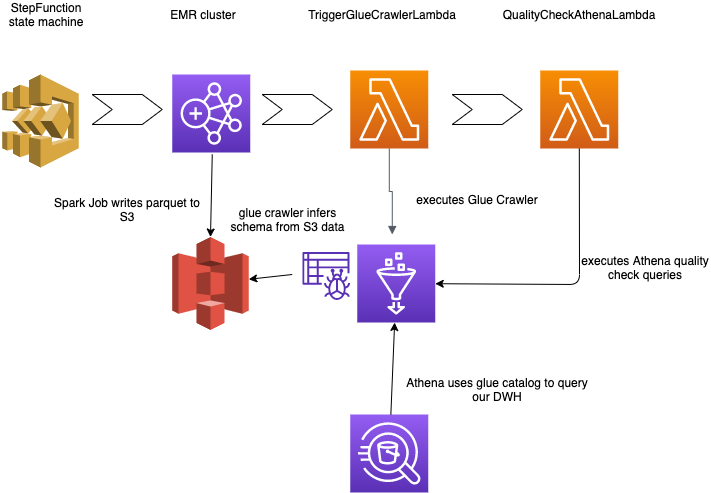
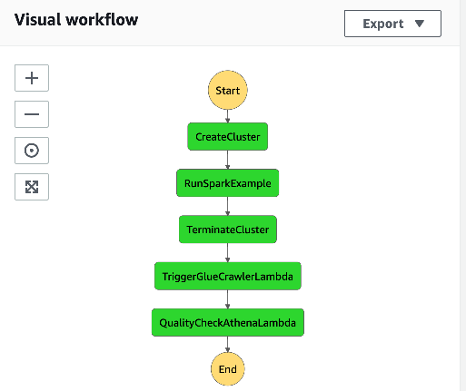
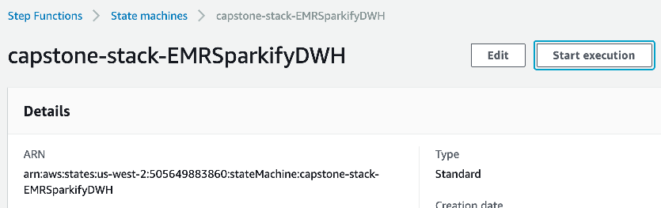
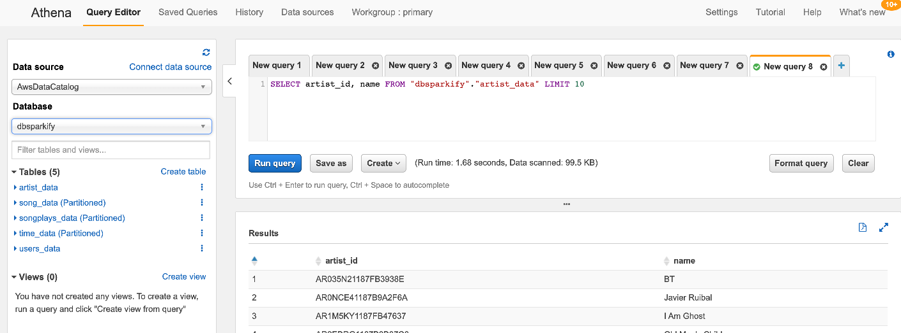

# Capstone introduction

As we learned in the last chapter, reliable robust data pipelines are very valuable
in the day to day job of an Data Engineer.
Since I also wanted to use the chance to deepen my knowledge regarding AWS,
I searched for ways how to build data pipelines with AWS. Of course, one could deploy an
EC2 Airflow instance. But doing my research I also found AWS StepFunctions which have a similar
concept as Airflow (building a graph with different execution steps).
Another important fact for me was to maintain reproducibility. I liked the Redshift deployment in the
course material, where we used `boto3`. The resources were defined in code and one could execute a Jupyter Notebook
instead of clicking everything together on AWS UI. Digging deeper, I found the AWS CDK framework, which made the concept
of IaC (Infrastructure as Code) even more accessible than `boto3`, by using normal python object programming.

With these two major components (Stepfunctions & IaC with CDK) my capstone project does not focus on the data itself
that much. But rather a defined workflow - still I am convinced, that this is very valuable for every Data Engineer.

My setup makes it quite easy to execute the PySpark job I created for Project submission 3. That is why I also
included it in this project for reference. 

On a side note: By setting up the right roles and access permission it is no 
longer necessary to pass credentials into our PySpark program from a config file. CDK will take care of that (by 
executing `cdk deploy ...` cdk has access to our local AWS credentials and uses them to create necessary roles).

# Data

Since this project is heavily focused around reliable development and deployment of data pipelines, I did not
specialise on new data.
Instead I used the well known sparkify data basis that we used throughout all projects. Hence, also my
data model of choice is very similar with Fact table `songstable` and dimensions `artists`,
`songs`, `time` and `users`.


# Deployment

First you need to install `cdk`. This can be done via `npm install -g aws-cdk`. There is also
documentation available at https://docs.aws.amazon.com/cdk/latest/guide/getting_started.html .

For further detail you can also checkout the documentation and
this tutorial https://cdkworkshop.com/ which helped me a lot (indeed I took the project structure 
that was given after issuing `cdk init ...`)

After installation activate your env an just enter

```
$ python3 -m venv .env
```

After the init process completes and the virtualenv is created, you can use the following
step to activate your virtualenv.

```
$ source .env/bin/activate
```

Once the virtualenv is activated, you can install the required dependencies.

```
$ pip install -r requirements.txt
```

Now your `.env` has all necessary dependencies.
Finally, you can deploy this app via `cdk deploy capstone-stack`.


# Architecture
The stepfunction ETL pipeline consists of different steps that will be described in the following.
I used `draw.io` to picture the different components of my stack:



For a rough overview the following picture from the stepfunction UI is also quite helpful:



The stepfunction resembles our architecture quite good (which is a good thing, as we learned in the
lesson about data lineage :)

# Execution

After the defined stack has been deployed you can navigate to your AWS UI.
Choose the StepFunction service and notice the new StateMachine.
When you hit "Start Execution" the EMR cluster will spin up and afterwards trigger the job.
When the job finished, the EMR cluster will stop.



Note: S3 buckets store immutable data that will not be destroyed with `cdk destroy ...`. You need to
delete them manually if you want to start a brand new deployment.

The job will run about 1 hour with the configured settings on full data. If you
want more power, just define more worker nodes in the CDK EMR cluster setup.

## EMR Cluster

The first step of our stepfunction is to create an EMR cluster. The configuration
is quite similar to the one we used in the course - except a newer emr version (`6.0.0`).
After our PySpark Job has finished, the stepfunction triggers another task that will shut down our 
EMR Cluster to save costs.

## Glue Crawler
As discussed in the course there is the option to implement a 'serverless' DWH via Glue Crawlers.
In the course we clicked together a small glue crawler on the UI. Like with all 
AWS resources this can also be created via CDK. So I setup a small DWH-Glue-Crawler that will
investigate the output data of our EMR-Spark job and infer a schema.
The inferred tables are then available in Athena:


We can check the inferred schema via e.g. `describe dwh_udacity_capstone.songplays_data;`

```sql
start_time          	bigint              	                    
user_id             	int                 	                    
level               	string              	                    
song_id             	string              	                    
artist_id           	string              	                    
session_id          	int                 	                    
location            	string              	                    
user_agent          	string              	                    
songplay_id         	bigint              	                    
year                	string              	                    
month               	string              	                    
	 	 
# Partition Information	 	 
# col_name            	data_type           	comment             
	 	 
year                	string              	                    
month               	string     
```

*Note*: The glue crawler not only infers the right types, but also notices that our data is partitioned.
Athena makes use of this fact to optimize Queries.

Because there was no stepfunction task available for triggering a Glue crawler ( see https://docs.aws.amazon.com/cdk/api/latest/python/aws_cdk.aws_stepfunctions_tasks.html )
I used a lambda function that manually does the job via `boto3`.

## Data Quality Checks
Also data quality checks can be implemented via my cdk setup.
For this, we just use another lambda function, that queries the created Athena tables,
after the glue crawler did its job.
The lambda itself can hold any queries for which we want to check the result set.
I used a small one that I also used in my project submission with Airflow.

*Note*: You need to set your own data output bucket in the Lambda.

# DWH Tasks
You can now use Athena for querying the proposed data model.
Note: You might need to set a query result location in Athena settings on the AWS UI


